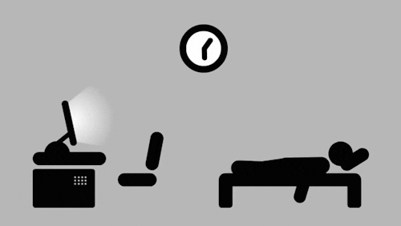

<h1> I'm a Software Engineer </h1>

<ul>
	<li>👨‍💻 I am currently working in a company and on my side projects in my free time (a bit too much at times).</li>
	<li>📚 Learning everything about Frontend and Backend technologies 😅</li>
	<li>💪🏼 Future Goals: Learn more technologies - Never stop creating new ideas.</li>
</ul>

<h2> My activity </h2>
<h6> Even if for me the activity on github does not reflect the level of a developer, I know that for some it is important. I try to contribute as much as possible in my free time, but unfortunately not all agencies store their project on GitHub, which means that despite the fact that I work every day, you don't see my activity on GitHub 👀</h6>

  <picture>
    <source media="(prefers-color-scheme: dark)" srcset="https://raw.githubusercontent.com/sovetski/sovetski/snake-output/github-contribution-grid-snake-dark.svg"/>
    <source media="(prefers-color-scheme: light)" srcset="https://raw.githubusercontent.com/sovetski/sovetski/snake-output/github-contribution-grid-snake.svg"/>
    
  </picture>

<h2> There are some statistics about my profile </h2>

	<picture>
		<source
		  srcset="https://github-readme-stats-wine-five-23.vercel.app/api?username=sovetski&count_private=true&show_icons=true&hide_title=true&theme=dark"
		  media="(prefers-color-scheme: dark)"
		/>
		<source
		  srcset="https://github-readme-stats-wine-five-23.vercel.app/api?username=sovetski&count_private=true&show_icons=true&hide_title=true&theme=default"
		  media="(prefers-color-scheme: light), (prefers-color-scheme: no-preference)"
		/>
		
	</picture>

	<picture>
		
	</picture>

